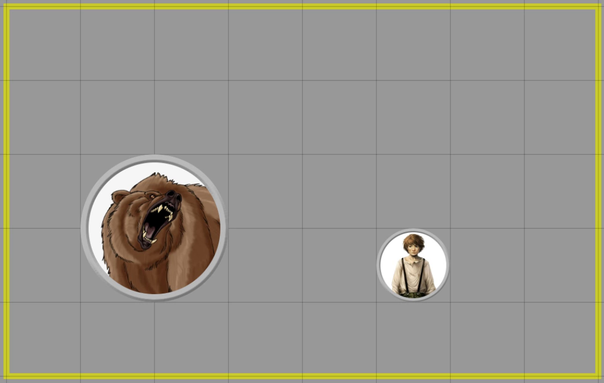
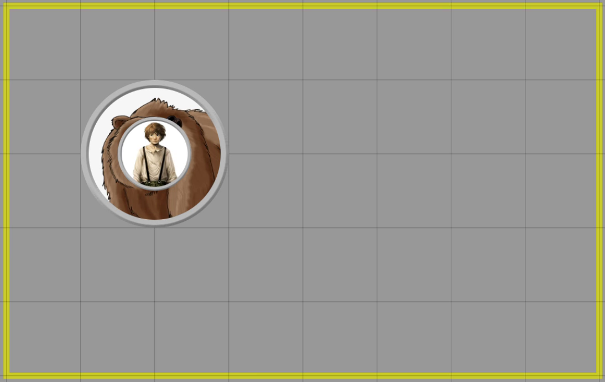

# Mount Up!
**Mount Up!** is a module for [Foundry VTT](https://foundryvtt.com/  "Foundry VTT") that allows tokens to carry or be carried by other tokens. This is completely system agnostic, and fully customizable to fit right into your game.

## NOTE

This is just a upgrade of the wonderful work of brunhine, hope to see you back.

# Installation
It's always better and easier to install modules through in in app browser. Just search for "Mount Up!"

To install this module manually:
1. Inside the Foundry "Configuration and Setup" screen, click "Add-on Modules"
2. Click "Install Module"
3. In the "Manifest URL" field, paste the following url:
`https://raw.githubusercontent.com/p4535992/MountUp/master/src/module.json`
4. Click 'Install' and wait for installation to complete
5. Don't forget to enable the module in game using the "Manage Module" button

### libWrapper

This module uses the [libWrapper](https://github.com/ruipin/fvtt-lib-wrapper) library for wrapping core methods. It is a hard dependency and it is recommended for the best experience and compatibility with other modules.

### token-attacher

This module uses the [token-attacher](https://github.com/KayelGee/token-attacher) library like a dependency. It is a hard dependency and it is recommended for the best experience and compatibility with other modules.

## Mounting

To mount a token:
1. Select the "rider" and the "mount" tokens.
2. Right click on the "mount" icon to bring up the token HUD.
3. Click on the horse icon (you can change this in your game).\
\
*The rider will now be linked to the mount. Anywhere the mount moves, the rider follows.*

## Dismounting

To dismount a token from a token:
1. Right click on the "mount" to bring up the token HUD.
2. Click on the dismount icon.\
\
*The rider will now be un-linked from the mount, and is free to move on their own.*

## Macros

Some functionality is exposed to macros for repeatable usage. All macros will either accept a token ID or name (case insensitive).

#### Mounting

You can mount a rider to a mount using the following syntax:

`MountUp.mount('RiderNameOrId', 'MountNameOrId')`

or you can use the module 'token-attacher'

### Dismounting

You can have a rider dismount by passing it's token name or id:

`MountUp.dismount('RiderNameOrId)`

or you can use the module 'token-attacher'

### Drop a rider from a mount

You can have a mount drop its rider by passing the mount's name or id:

`MountUp.dropRider('MountNameOrId')`

or you can use the module 'token-attacher'

## [Changelog](./changelog.md)

# Localization
Japanese Language support provided by [BrotherSharper](https://github.com/BrotherSharper) ('Brother Sharp#6921' on discord)

*always welcoming more translations*
# Feedback

Any issues, bugs, or feature requests are always welcome to be reported directly to the [Issue Tracker](https://github.com/p4535992/mountup/issues ), or using the [Bug Reporter Module](https://foundryvtt.com/packages/bug-reporter/).
# Licensing

**Mount Up!** is a module for [Foundry VTT](https://foundryvtt.com/  "Foundry VTT") by Jeremiah Altepeter and is licensed under a [Creative Commons Attribution 4.0 International License](http://creativecommons.org/licenses/by/4.0/).

This work is licensed under Foundry Virtual Tabletop [EULA - Limited License Agreement for module development v 0.1.6](https://foundryvtt.com/article/license/).
## Acknowledgements

Bootstrapped with Nick East's [create-foundry-project](https://gitlab.com/foundry-projects/foundry-pc/create-foundry-project).

Mad props to the 'League of Extraordinary FoundryVTT Developers' community which helped me figure out a lot.
